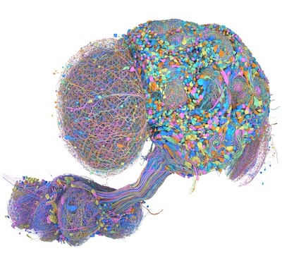

# malecns



<!-- badges: start -->

[](https://lifecycle.r-lib.org/articles/stages.html#experimental)
[](https://github.com/natverse/malecns/actions)

<!-- badges: end -->

The goal of **malecns** is to provide [natverse](https://natverse.org)
access to the [whole male central nervous system
dataset](https://www.janelia.org/project-team/flyem/male-cns-connectome).
This is a collaborative project between the [Janelia FlyEM Project
Team](https://www.janelia.org/project-team/flyem/) and the [Drosophila
Connectomics
Group](https://www.zoo.cam.ac.uk/research/groups/connectomics) in
Cambridge.

Although you can access the malecns dataset via the
[neuprintr](https://github.com/natverse/neuprintr) package just like any
other neuprint dataset, this **malecns** package provides some
additional conveniences. For example, it gives access to all metadata
columns including useful ones like:

-   flywireType (corresponding type in FlyWire-FAFB dataset)
-   mancType (corresponding type in male VNC dataset)
-   itoleeHl (hemilineage identity acording to Lee/Ito 2013 papers)

## Quick start

``` r
install.packages("natmanager")
natmanager::check_pat()
natmanager::install(pkgs="natverse/malecns")


## Set your Neuprint token
# will open your browser
# collect token by clicking on your account icon top right and then Account
browseURL('https://neuprint.janelia.org')
# back in R
usethis::edit_r_environ()
# paste in this text replacing with your neuprint token
# make sure you have a new lined at the end of the file
neuprint_token="eyJhbGci..."

# check everything's configured ok
dr_malecns()

# get some data
pnmeta=mcns_neuprint_meta('/.+_[adl]+PN')
table(pnmeta$type)
vm6=read_mcns_meshes('VM6_adPN')
plot3d(malecns.surf, alpha=.1)
```

## Introduction

**malecns** is presently a very thin wrapper around the
[malevnc](https://github.com/flyconnectome/malevnc) package. In due
course we would hope to separate out some of the more generic
functionality from the **malevnc** package. However, the current
arrangement means that some of the configuration for using the
**malecns** package is handled by the **malevnc** package.

## Installation

You can install the released version of malecns from GitHub

``` r
install.packages("natmanager")
natmanager::install(pkgs="natverse/malecns")
```

### Authentication

Access to neuprint depends on authentication. Please see
<https://github.com/natverse/neuprintr#authentication>; you only need to
set a `NEUPRINT_TOKEN` R environment variable. You can display your
neuprint token after logging into the neuprint website.

Clio authentication supports write access to the dataset and shouldn't
be required by regular users.

## Example

This example shows you how to read some meshes, look up ids by position
and transform positions from FlyWire/FAFB14.

``` r
library(malecns)
## read meshes for some annotated neurons

ml=read_mcns_meshes("/type:(DA1|DL3)_lPN")
# set metadata for this neuronlist
ml[,]=mcns_neuprint_meta(names(ml))
plot3d(ml, col=type)

library(natverse)
library(fafbseg)
# transform a point in FlyWire voxel space to malecns voxel space
# and put it on the clipboard ready to paste into neuroglancer
clipr::write_clip(xform_brain(cbind(109953, 50450, 1660)*c(4,4,40), 
  reference = 'malecns',   sample = 'FlyWire')/8)
```


## Updating

If you need to update your malecns install, I recommend:

```         
natmanager::install(pkgs="flyconnectome/malecns")
```

## Production access

The default dataset is a public read only snapshot, `malecns-v0.9`.
Collaborators working on (what at this point will only be minor) updates
to the read/write production dataset will need neuprint authentication
as above. They will also need Clio authentication and user configuration
as below.

To switch between datasets in the current session use
`choose_mcns_dataset()`

```         
choose_mcns_dataset("CNS")
mcns_body_annotations(194965)
choose_mcns_dataset("male-cns:v0.9")
mcns_body_annotations(194965)
```

You can also permanently set

```         
options(malecns.dataset = 'CNS')
```

in your `.RProfile`.

### Clio authentication

If you are working to update the production dataset, you may For Clio,
you will prompted to authenticate via a Google OAuth "dance" in your web
browser. Note that the Clio and neuprint tokens look similar, but are
*not* the same. Your neuprint token appears to be indefinite while the
clio token currently lasts 3 weeks.

### Configuration

For interaction with the Clio/DVID annotation systems you may need to
tell R+malecns about the emails that you used to sign up for
Clio/neuprint.

``` r
usethis::edit_r_profile()
# paste in this text, appropriately edited, and close the file
options(malevnc.clio_email="myuser@gmail.com")
# e.g. "jefferisg"
options(malevnc.dvid_user="<surname><firstinitial>")
```
